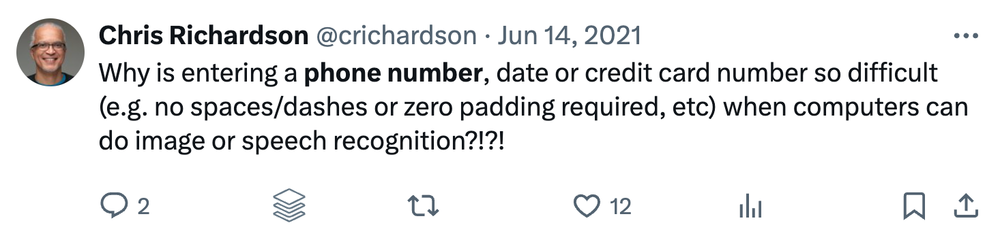

= Faramir: An LLM powered microservice for validating and formatting phone numbers

I was recently reminded of a tweet from 3 years that described how some websites make it difficult to enter information, such as a phone number:



The obvious solution is to use today's golden hammer: an LLM, or more specifically, OpenAI's GPT-4.

== About Faramir

Faramir is a simple Python-based microservice that uses OpenAI to validate and format phone numbers.
You could, for example, use Faramir to make it easier for users to enter phone numbers in a web form.

Running the service:

```shell
export OPENAI_API_KEY=<your-openai-api-key>

$ uvicorn --reload faramir:app
```

Validating and parsing phone numbers:

```shell
$ http POST localhost:8000/parse phoneNumber=5105551212
HTTP/1.1 200 OK
content-length: 27
content-type: application/json
date: Fri, 29 Mar 2024 22:25:58 GMT
server: uvicorn
{
    "result": "(510) 555-1212"
}
```

and

```shell
$ http POST localhost:8000/parse phoneNumber=510555121
HTTP/1.1 400 Bad Request
content-type: application/json
date: Fri, 29 Mar 2024 22:26:26 GMT
server: uvicorn
```

== How it works

The service uses https://www.langchain.com[Langchain], which is a popular Python framework, to invoke OpenAI's LLM to parse the phone number. 

The code invokes the LLM with a prompt that instructs the LLM to validate the phone and, if it's correct, return it in a standard format.

== Why Faramir?

It's important for a service to have an *intention revealing name*.
Famamir, a character from Lord of the Rings, was chosen because to quote ChatGPT:

> Faramir is known for his discernment, integrity, and the careful consideration he gives to his actions, much like the precision required in validating and formatting phone numbers. He's also a communicator and a mediator in several key situations, making the link to a service that ensures communication can proceed smoothly quite appropriate.

== Parody warning

The timing of this project is not a coincidence. It's a parody of the current state of the industry where services often have intention obscuring names and it seems like every problem is should be solved by an LLM.

Having said that, this project is a simple example of how to use an LLM to solve what could be a real-world problem.
